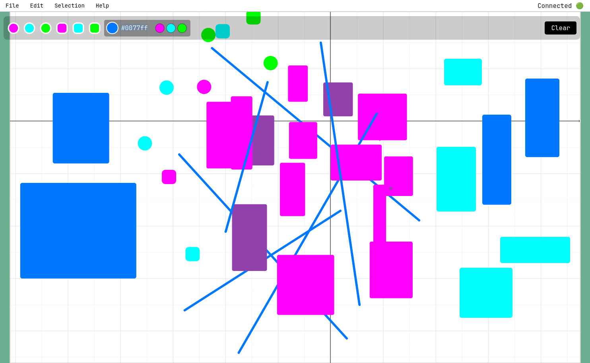
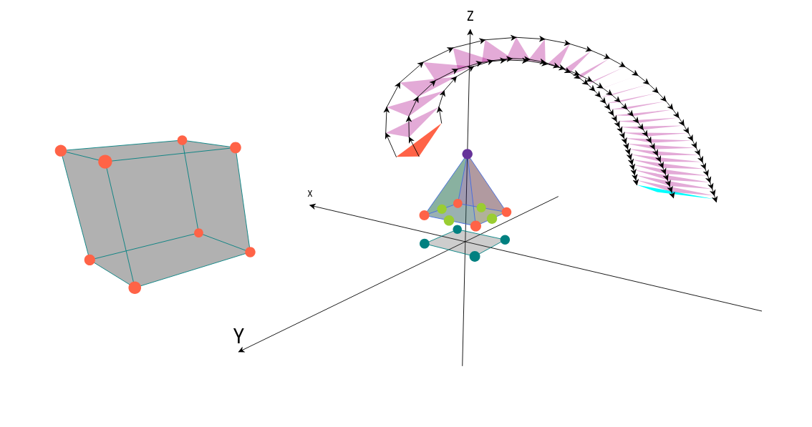

# Geomextric

This is a proof of concept for building an interactive and collaborative 2D and 3D drawing canvas via Phoenix LiveView.

**Warning**: Nothing is stored persistently and no convenient export feature is available.

Currently only a single canvas shared between all users is available.

Colored lines, dots and rectangles can be drawn. The 2d canvas is quasi infinite can can be panned, zoomed, rotated via native scrollbars, mouse and multi touch controls. The scrollable is adjusted to the bounding box of the actual content.

The canvas content is stored inside a GenServer and rendered as inline SVG. The GenServer also stores an undo/redo stack of snapshots.

Existing elements can be selected, dragged around and deleted.

The 3d view is also rendered as SVG. The perspective transformation is calculated inside the LiveView process on the server for each user.

The 3d geometric calculations based on [Geometric Algebra](https://bivector.net) and available via the separate [Galixir](https://github.com/laszlokorte/galixir) Elixir package.

## Phoenix Development Environment

### Start developing

To start your Phoenix server:

- Run `mix setup` to install and setup dependencies
- Start Phoenix endpoint with `mix phx.server` or inside IEx with `iex -S mix phx.server`

Now you can visit [`localhost:4000`](http://localhost:4000) from your browser.

Ready to run in production? Please [check our deployment guides](https://phoenix.hexdocs.pm/deployment.html).

### Umbrella project

This is an Elixir umbrella project. It is composed of multiple apps:

- [Geomextric](apps/geomextric) - The core logic
- [GeomextricWeb](apps/geomextric_web) - The Phoenix web interface

Each app has its own README and configuration.

## Learn more

- Official website: https://www.phoenixframework.org/
- Guides: https://phoenix.hexdocs.pm/overview.html
- Docs: https://phoenix.hexdocs.pm
- Forum: https://elixirforum.com/c/phoenix-forum
- Source: https://github.com/phoenixframework/phoenix
